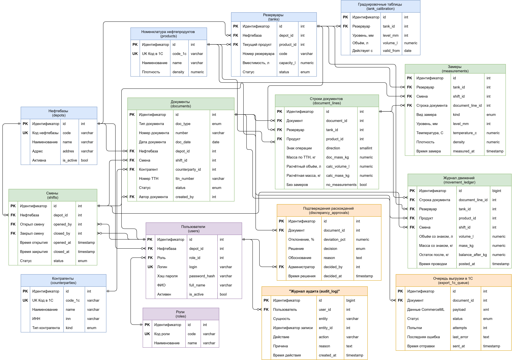

# NeftBaza-Pro — oil depot management system

Material accounting for petroleum products: intake, dispatch, blending,
reservoir balances and material reports across multiple depots.

**My role:** systems analyst — business process analysis, requirements,
UML modelling, data model and API design, UI prototype.

## Artifacts

| Artifact | File |
|---|---|
| Portfolio (full documentation) | [docs/portfolio.pdf](docs/Portfolio_NeftBaza_Pro.pdf) |
| API specification, OpenAPI 3.1 | [docs/openapi.yaml](docs/openapi.yaml) |
| Use Case diagram | [diagrams/use-case.png](diagrams/UseCase.pdf) |
| ERD — 15 tables | [diagrams/erd.png](diagrams/ERD.pdf) |
| BPMN As-Is / To-Be | [diagrams/](diagrams/BPMN.pdf) |

## Live demo

https://nodirbekshodiyev94.github.io/neftbaza-pro

## Key design decisions

- **Single documents table with a discriminator** — intake, dispatch,
  transfer, blending and inventory differ by `doc_type`.
- **Movement Ledger as the single source of balances** — records are
  immutable; corrections are made by reversing entries.
- **Versioned calibration tables** — historical documents are always
  recalculated with the table that was valid on the operation date.
- **Queued 1C export** — document posting does not depend on the
  availability of the accounting system.

