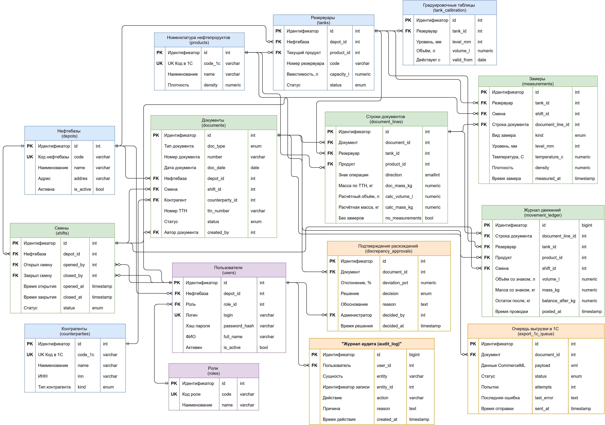

# Fluxo — система управления нефтебазой

Материальный учёт нефтепродуктов: приём, отпуск, компаундирование, остатки в резервуарах
и материальные отчёты по нескольким нефтебазам.

**Моя роль:** системный аналитик — анализ бизнес-процессов, требования,
UML-моделирование, проектирование модели данных и API, прототип интерфейса.

## Артефакты

| Артефакт | Файл |
|---|---|
| Портфолио (полная документация) | [docs/Portfolio_NeftBaza_Pro.pdf](docs/Portfolio_NeftBaza_Pro.pdf) |
| Спецификация API, OpenAPI 3.1 | [docs/openapi.yaml](docs/openapi.yaml) |
| Диаграмма вариантов использования (Use Case) | [diagrams/UseCase.pdf](diagrams/UseCase.pdf) |
| ERD — 15 таблиц | [diagrams/ERD.pdf](diagrams/ERD.pdf) |
| ERD → PostgreSQL: схема, бизнес-правила, тесты | [docs/07_erd.md](docs/07_erd.md) |
| SQL-скрипты базы данных | [database/](database/) |
| REST API (FastAPI) | [api/](api/) |
| BPMN As-Is / To-Be | [diagrams/BPMN.pdf](diagrams/BPMN.pdf) |

## Демо

https://nodirbekshodiyev94.github.io/Fluxo/

## Ключевые проектные решения

- **Единая таблица документов с дискриминатором** — приём, отпуск,
  перемещение, компаундирование и инвентаризация различаются полем `doc_type`.
- **Журнал движений (Movement Ledger) — единственный источник остатков** —
  записи неизменяемы; исправления выполняются сторнирующими записями.
- **Версионируемые градуировочные таблицы** — исторические документы всегда
  пересчитываются по таблице, действовавшей на дату операции.
- **Выгрузка в 1С через очередь** — проведение документов не зависит
  от доступности учётной системы.

